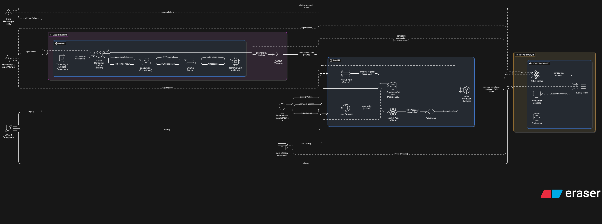

# PAP-agentic-ai-sdk

This is the official SDK for the PAP agentic AI.

## Architecture Diagram 🏗️

Here is the high-level architecture of the system. Click the diagram to see the full-size version.

[](assets/arch_diagram.png)

## Installation

To create an identical environment, run the following command:

```bash
pip install -r requirements.txt
```
